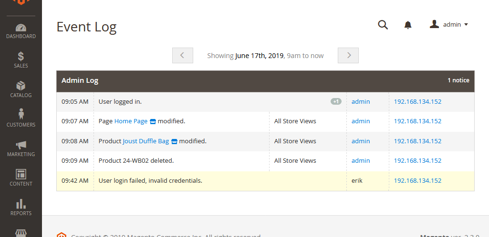

# Magento 2 Event Log

Magento 2 plugin to log events.

It currently only logs a limited set of the stock Magneto 2 admin actions and is mostly intended for use
by developers creating sites that have background tasks which need a visible log in the admin.



## Logging Example

```php
/** @var \Magento\Framework\Event\ManagerInterface $eventManager */

// Add an info event.  This would be rendered in the "Admin Log" group admin events get logged to.
$eventManager->dispatch('event_log_info', [
    'group' => 'admin',
    'message' => 'Banner {banner} {action}.',
    'context' => [
        'banner' => $banner->getName(),
        'banner-id' => $banner->getId(),
        'action' => $banner->isObjectNew() ? 'created' : 'modified',
    ],
]);
```

Placeholders are used in the message for translatability (not yet implemented).  The
`banner-id` context value above would not be used unless a placeholder handler is
created that makes use of it since `{banner-id}` is not included in the message.
See [custom-placeholders](.docs/custom-placeholders.md) for a placeholder handler
example.

*Your code should not rely on Event Log plugin code to add events or it will fail if the Event Log
plugin is removed or disabled.  For that reason you should always call the generic Magento 2 event
dispatcher to add logs.*


## Events

### `event_log_info`

Logs a standard entry.


### `event_log_error`

Logs an error which will be rendered with a red background.


### `event_log_warning`

Logs a warning which will be rendered with a yellow background.


### `event_log_security`

Logs a security entry which renders the same as warning but will always render all entries, regardless
of the hide duplicates setting.


## Event Options

### `group`

Type: `String`

The group id to render the message with.  If the group is not handled by a custom renderer it will use
the standard renderer with the supplied group id converted to title case.


### `message`

Type: `String`

The event log message.  Dynamic portions should use {curly-brackets} and the `context` array.


### `context`

Type: `Array`

The context for the event log message.  The context can include non-string values but any keys referenced
in the message string must be strings or the message will not be recorded.


### `user`

Type: `\Magento\User\Model\User`

The user for the event log message.  If set will attach the user information to render with the log
entry.


## License

[MIT](https://opensource.org/licenses/MIT)
